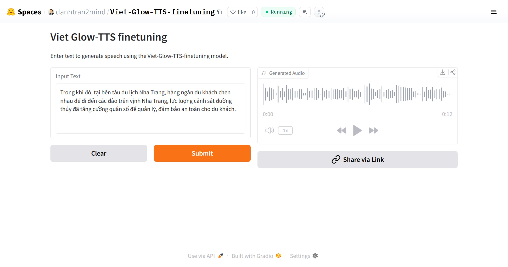

# Viet Glow-TTS Finetuning 📢

[](https://github.com/danhtran2mind/Viet-Glow-TTS-finetuning/stargazers)


[](https://huggingface.co/docs/hub)
[](https://pytorch.org/)
[](https://github.com/coqui-ai/TTS)
[](https://gradio.app/)
[](https://opensource.org/licenses/MIT)

## Introduction
Transform text into natural, high-quality Vietnamese speech with Viet Glow-TTS, a fine-tuned text-to-speech (TTS) model optimized for the Vietnamese language. Built upon the Glow-TTS framework, this project delivers authentic Vietnamese audio output with improved clarity and expressiveness. 🌟

## Key Features
- 🗣️ Generate natural-sounding Vietnamese speech from text
- ⚡ Optimized for performance with fine-tuned Glow-TTS
- 📓 Comprehensive notebook for training and inference
- 🌐 Interactive Gradio demo for real-time TTS generation
- 🔧 Supports both CPU and GPU for flexible deployment

## Notebook
Explore the training and inference process with our comprehensive notebook:  
[](https://colab.research.google.com/github/danhtran2mind/Viet-Glow-TTS-finetuning/blob/main/notebooks/glow-tts.ipynb)
[](https://studiolab.sagemaker.aws/import/github/danhtran2mind/Viet-Glow-TTS-finetuning/blob/main/notebooks/glow-tts.ipynb) 
[](https://deepnote.com/launch?url=https://github.com/danhtran2mind/Viet-Glow-TTS-finetuning/blob/main/notebooks/glow-tts.ipynb)
[](https://mybinder.org/v2/gh/danhtran2mind/Viet-Glow-TTS-finetuning/main?filepath=notebooks/glow-tts.ipynb)
[](https://console.paperspace.com/github/danhtran2mind/Viet-Glow-TTS-finetuning/blob/main/notebooks/glow-tts.ipynb)
[](https://mybinder.org/v2/gh/danhtran2mind/Viet-Glow-TTS-finetuning/main)
[](https://github.com/danhtran2mind/Viet-Glow-TTS-finetuning/blob/main/notebooks/glow-tts.ipynb)
[](https://www.kaggle.com/notebooks/welcome?src=https%3A%2F%2Fgithub.com%2Fdanhtran2mind%2FViet-Glow-TTS-finetuning/blob/main/notebooks/glow-tts.ipynb)

## Dataset
The model is trained on a curated Vietnamese TTS dataset, ensuring high-quality and authentic audio output. Explore more details at: [](https://huggingface.co/datasets/ntt123/viet-tts-dataset)

## From Scratch Model
This project builds upon the Glow-TTS framework, fine-tuned specifically for the Vietnamese language to achieve natural intonation and pronunciation. The model is trained from scratch using the curated dataset, with optimized hyperparameters for enhanced audio quality and performance. 🚀

## Demonstration
Experience real-time Vietnamese TTS generation:  
- **HuggingFace Space**: [](https://huggingface.co/spaces/danhtran2mind/Viet-Glow-TTS-finetuning)  

- **Demo GUI**:  
  

To run the Gradio app locally (`localhost:7860`):  
```bash
python app.py
```

## Installation

### Step 1: Clone the Repository
Clone the project repository and navigate to the project directory:  
```bash
git clone https://github.com/danhtran2mind/Viet-Glow-TTS-finetuning.git
cd Viet-Glow-TTS-finetuning
```

### Step 2: Install Dependencies
Install the required Python packages:  
```bash
pip install -r requirements.txt
```

## Usage

### Run Gradio App Locally
Launch the Gradio app for interactive TTS generation:  
```bash
python app.py
```

### Using Python API
Generate TTS audio output programmatically:  
```python
from TTS.api import TTS
import torch

# Define paths and input
check_point_folder = "./ckpts"
model_path = f"{check_point_folder}/best_model.pth"
config_path = f"{check_point_folder}/config.json"
out_path = "tests/test_output/tts_output.wav"
text = ("Mưa kéo dài không ngớt, khiến đường phố Hà Nội xuất hiện 85 điểm úng ngập. Vào giờ tan tầm, "
        "nhiều người dân phải cố vượt qua 'biển nước' để trở về nhà.")

# Set device (GPU if available, else CPU)
device = torch.device("cuda" if torch.cuda.is_available() else "cpu")

# Initialize TTS model
tts = TTS(model_path=model_path, config_path=config_path, progress_bar=True)

# Move model to the specified device
tts.to(device)

# Perform inference and save to file
tts.tts_to_file(text=text, file_path=out_path, speaker=None, language=None, split_sentences=False)
```

Display the generated audio:  
```python
from IPython.display import Audio
Audio("tests/test_output/tts_output.wav")
```

## Inference Samples
- Input Text:
Trong khi đó, tại bến tàu du lịch Nha Trang, hàng ngàn du khách chen nhau để đi đến các đảo trên vịnh Nha Trang, lực lượng cảnh sát đường thủy đã tăng cường quân số để quản lý, đảm bảo an toàn cho du khách.
- Output Audio:
  
https://github.com/user-attachments/assets/d4155176-c723-4578-bf08-1e38662e649f

## Environment
- **Python**: 3.8 or higher
- **Key Libraries**: See [requirements.txt](requirements.txt) for compatible versions

## Contact
For questions or issues, please use the [GitHub Issues tab](https://github.com/danhtran2mind/Viet-Glow-TTS-finetuning/issues) or the [Hugging Face Community tab](https://huggingface.co/spaces/danhtran2mind/Viet-Glow-TTS-finetuning/discussions). 📬


